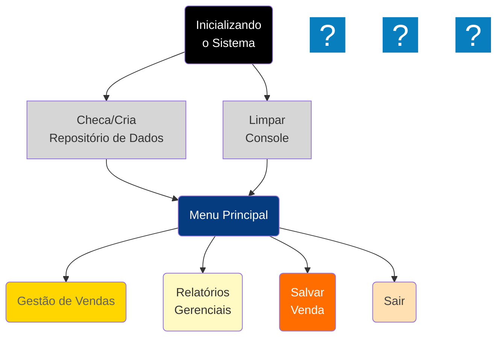

## 1. 🗺️ Cabeçalho e Informações Básicas

# Sistema de Gestão de Vendas
**Disciplina:** Programação para Ciência de Dados  
**Curso:** MBA Ciência de Dados - UNIFOR  
**Instrutor:** Cássio Pinheiro  
**Integrantes:** Stevens de Castro Maia | Matrícula:2529157
**Repositório GitHub:** [(https://github.com/stevens-castro/mba_project)]

## 2. 📋 Objetivo

Desenvolver um sistema simples para gestão de vendas para lojas de pequeno porte com foco em venda de equipamentos eletrônicos. O público
alvo inicial do projeto serão os empreendedores que não tem capital para investir em uma plataforma de vendas completas. Dessa forma estamos
entregando uma solução de baixo custo que permitirá o inícioo das operações com as funcionalidades básicas, permitindo uma gestão mínima das vendas.
O sistema permitirá a gestão das vendas, dos produtos e dos vendedores. Com essas informações o gerente de vendas poderá tomar decisões baseadas em dados,
permitindo ações como campanhas promocionais para incentivar as vendas de produtos com maior retorno, quais os vendedores destaque e quais estão abaixo do esperado,
assim como uma visão sobre o desempenho das vendas no período.

## 3. 📊 Diagrama de Contexto


## 4. 🔧 Funcionalidades Implementadas 

1. **Cadastrar Nova Venda**
   - Registrar venda com as seguintes informações (id_produto, produto, vendedor, quantidade, valor unitário, valor_total, data)
   - Valor total da venda campo calculado automaticamente por meio da multiplicação do valor unitário pela quantidade vendida
   - Validação dos dados de entrada, prevenindo que informações inconsistentes sejam inseridas na base de dados   

2. **Relatório de desempenho de vendas por vendedor**
   - Campos do relatório 
    - Ranking de vendedores
    - Nome vendedor
    - Valor total vendido (R$)
    - Quantidade de vendas por vendedor
    - Valor médio por venda por vendedor 

3. **Relatório de vendas por produto**
   - Campos do relatório 
    - Descrição Produto
    - Quantidade total vendida por produto
    - Receita por produto
    - Produtos mais vendidos (ranking)

4. **Relatório geral de vendas**
   - Campos do relatório 
    - id_venda (agrupador)     
        - id Produto
        - produto
        - vendedor
        - valor_total (qtd x valor unitário)
    
5. **Relatório mensal de vendas**
    - Campos do relatório 
      - seleciona o ano específico para realizar a análise
      - mês
      - produto
      - total vendido    

6. **Salvar Venda no BD(aruivo .txt)**
    - Salva os dados em memória(listas, dicionários) das vendas para um arquivo txt na pasta 'data' do sistema

7. **Gerador de dataset**
    - Função para gerar dados fictícios para testes do sistema e validação das funionalidades

## 5. 🎲 Estrutura de Dados

### Entrada

```python
# Venda individual
venda = {
    'id': 1,
    'regiao': 'Nordeste',
    'produto': 'WebCam 4k',
    'vendedor': 'Bruno',
    'cliente': 'Manoela',
    'quantidade': 2,
    'valor_unitario': 150.00,
    'data': '2025-10-15'    
}
```
### Saída

```python
# Lista de vendas cadastradas
vendas = [
    {
        'id': 1,
        'regiao': 'Nordeste',
        'produto': 'Notebook Dell',
        'vendedor': 'Maria Silva',
        'cliente': 'João de Deus',
        'quantidade': 2,
        'valor_unitario': 3500.00,
        'valor_total': 7000.00, # Valor unitário x quantidade
        'data': '2024-01-15'
        
    },
    # ... mais vendas
]

# Estatísticas por vendedor
estatisticas_vendedor = {
    'Maria Silva': {
        'total_vendas': 12500.00,
        'quantidade_vendas': 3,
        'valor_medio': 4166.67
    }
}

# Estatísticas por produto
estatisticas_produto = {
    'Notebook Dell': {
        'total_vendido': 14000.00,
        'quantidade_vendida': 4,
        'receita': 14000.00
    }
}
```

## 6. 💻 Requisitos Técnicos

- Python 3.12+
 - Versão do Python utilizada
    - Python 3.12.3
 - Bibliotecas e dependências
    - pandas (com versões)
    - numpy
 - Requisitos de sistema (se houver)
 - Como instalar as dependências

## 7. 🕹️ Como Executar o Projeto

 - Passo a passo para instalação
 - Como executar o código principal
 - Exemplos de uso
 - Comandos necessário

## 8. 📈 Análises Realizadas

 - Descrição das análises realizadas
 - Principais insights encontrados
 - Visualizações criadas e seus propósitos
 - Estatísticas calculada


## 9. 🏬 Estrutura do Projeto

  - Inserir a imagem da estrutura do projeto


## 10. 📸 Capturas de Tela / Exemplos de Saída
  - Inserir as capturas das telas do sitema

## 11. 🧪  Testes Realizados
  - Descreve os testes realizados

## 12. 📒 Referências e Bibliografia
 Documentação consultada
 Tutoriais utilizados
 Datasets utilizados (com links


## 13. 👥 Contribuições dos Integrantes
  - Divisão de trabalho
    - Não se aplica pois fiz o trabalho de forma individual
  - Responsabilidades de cada integrante:
    - Não se aplica pois fiz o trabalho de forma individual
  - Commits principais de cada membro
    -


## 14. 🚀 Próximos Passos / Melhorias Futuras
 - Funcionalidades que poderiam ser adicionadas
 - Melhorias técnicas possíveis
 - Expansões do projeto