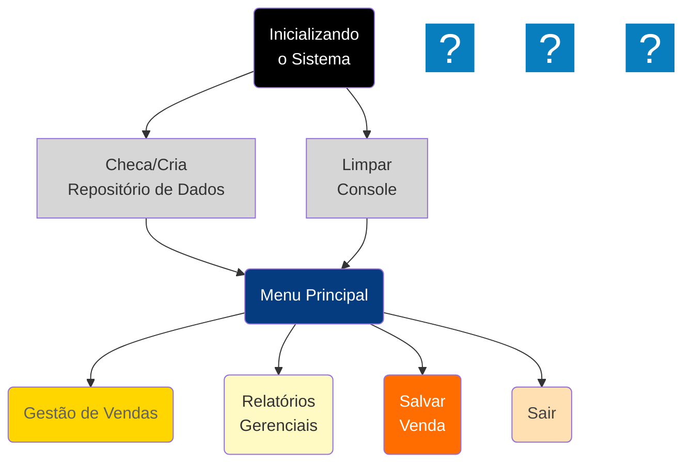

## 1. 🗺️ Cabeçalho e Informações Básicas

# Sistema de Gestão de Vendas - Tech Vendas
**Disciplina:** Programação para Ciência de Dados  
**Curso:** MBA Ciência de Dados - UNIFOR  
**Instrutor:** Cássio Pinheiro  
**Integrantes:** Stevens de Castro Maia | Matrícula:2529157
**Repositório GitHub:** [(https://github.com/stevens-castro/mba_project)]

## 2. 📋 Objetivo

Desenvolver um sistema simples para gestão de vendas para lojas de pequeno porte com foco em venda de equipamentos eletrônicos. O público
alvo inicial do projeto serão os empreendedores que não tem capital para investir em uma plataforma de vendas completas e que utilizam o excel para gerenciar suas vendas.
Dessa forma estamos entregando uma solução de baixo custo que permitirá o início das operações com as funcionalidades básicas, permitindo uma gestão mínima das vendas.

O sistema permitirá a gestão das vendas, dos produtos e dos vendedores. Com essas informações o gerente de vendas poderá tomar decisões baseadas em dados,
permitindo ações como, campanhas promocionais para incentivar as vendas de produtos com maior retorno, quais os vendedores destaque e quais estão abaixo do esperado,
assim como uma visão sobre o desempenho das vendas no período e qual regiao tem melhores oportunidades para a ampliação por meio de um dashboard interativo.

## 3. 📊 Diagrama de Contexto


## 4. 🔧 Funcionalidades Implementadas 

1. **Cadastrar Nova Venda**
   - Registrar venda com as seguintes informações ( data_venda, regiao, vendedor, cliente, id_produto, produto, quantidade, preco_unitario, custo_unitario,  faturamento, lucro)
   - Valor total da venda campo calculado automaticamente por meio da multiplicação do valor unitário pela quantidade vendida
   - Validação dos dados de entrada, prevenindo que informações inconsistentes sejam inseridas na base de dados   

2. **Relatório de desempenho de vendas por vendedor**
   - Campos do relatório 
    - Vendedor (Agrupador)
      - Quantidade
      - Faturamento
      - Lucro
      - Ranking de vendedores --> Classificação feita pelo faturamento( Ordem Decrescente)    

3. **Relatório de vendas por região**
   - Campos do relatório 
    - Regiao
      - Produto
      - Faturamento
    - Relatório Agrupado por região e produto   

4. **Relatório de vendas por produto**
   - Campos do relatório 
    - Produto
      - Quantidade
      - Faturamento
      - Lucro
    - Relatório Agrupado por produto 

5. **Relatório de Faturamento Anual**
    - Campos do relatório 
      - Ano/Mês
        - Região
        - Cliente
        - Faturamento
        - Custo
        - Faturamento Médio

6. **Salvar Venda no BD**
    - Salva os dados em memória(listas, dicionários) das vendas para o arquivo 'vendas.csv localizado na pasta 'data' do sistema
    - Esta função permite salvar um ou mais registros de vendas na mesma sessão e mostra a quantidade de registros salvos    

7. **Dataset Info**
    - Função para exibir informações sobre o nosso banco de dados('vendas.csv)

8. **Módulo Gerador de dataset**
    - Mdulo para gerar dados fictícios para testes do sistema e validação das funcionalidades
    - Ideal para demonstração do produto antes da implantação

9. **Módulo Dashboard_Vendas**
    - Módulo Web da aplicção que exibe os relatórios de forma gráfica e interativa 
    - Esse módulo possue as seguintes métricas:
      - Faturamento, quantidades de vendas, Lucros e ticket médio 
      - Visões
        - Faturamento e Lucro ao longo do tempo
        - Comparativo faturamento por região
        - Quantidade de vendas realizadas por região
      - Esse módulo permite filtros por região específica para análise das métricas definidas (Faturamento, Lucro e Quantidade de produtos vendidos).

10. **Módulo Análise Exploratória**
  - Módulo para análise inicial da base dados.
  - Utilizada para entendimento dos dados e identificação de possíveis ajustes e tratamentos na base de dados.
  - Além de permitir uma análise exploratória sobre a base de dados

## 5. 🎲 Estrutura de Dados da Aplicação

### Menu Principal

```python
# Dicionário que exibe o Menu Principal do Sistema
    dict_Menu = {
        "1": "Cadastrar Nova Venda",
        "2": "Relatório de Vendas por Vendedor",
        "3": "Relatório de Vendas por Região",
        "4": "Relatório de Vendas por Produto",
        "5": "Relatório Faturamento Anual",
        "6": "Salvar Venda no BD",
        "7": "Dataset Info",
        "8": "Sair",
       
    }
```

### Entrada

```python
# Venda individual
 nova_venda = {
        "data": data_venda,        
        "regiao": regiao,
        "vendedor": vendedor,
        "cliente": cliente,
        "id_produto": id_produto,
        "produto": produto,       
        "quantidade": quantidade,
        "preco_unitario": preco_unitario,
        "custo_unitario": custo_unitario,
        "receita": receita,
        "lucro": lucro ,             
        
    }  
    # ... mais vendas  
```
### Saída

```python
# Lista de vendas cadastradas
vendas = [
    {
        'Data': '2024-01-15',        
        'Regiao': 'Nordeste',
        'Produto': 'Notebook Dell',
        'Vendedor': 'Fernanda',
        'Cliente': 'João de Deus',
        'Id_Produto': 1,
        'Produto': 'WebCam_4k',
        'Quantidade': 2,
        "Preco_Unitario": 10000.00,
        'Custo_Unitario': 3500.00,
        'Faturamento': 7000.00, # Valor unitário x quantidade ,
        'Lucro': 5000.00, # Faturamento - Custo Total   
    },
    # ... mais vendas
]

# Estatísticas por vendedor
relatorio_vendedor = {
    'Maria Silva': {
        'Produto':'Notebook', 
        'Quantidade_vendas': 3,
        'Faturamento': 12500.00,        
        'Lucro': 4166.67
    }
}


# Estatísticas por região
relatorio_regiao = {
    'Sudeste': {
        'Produto':'WebCam 4k', 
        'Faturamento': 1250.00,         
    }
}

# Estatísticas por produto
estatisticas_produto = {
    'Notebook Dell': {
        'Quantidade_vendida': 4,
        'Faturamento': 14000.00,        
        'Lucro': 10000.00
    }
}

# Faturamento Anual
estatisticas_produto = {
    'Ano ': {
        'mes': 2,
        'Regiao': 'Centro Oeste',
        'Cliente': 'Fernanda',
        'Faturamento': 14000.00,        
        'Custo': 1500.00,        
        'Faturamento Médio': 6790.00        
    }
}

```

## 6. 💻 Requisitos Técnicos

- Python 3.12
 - Versão do Python utilizada
    - Python 3.12.3
 - Bibliotecas e dependências    
    - pandas 2.3.3
    - numpy 2.3.4
    - matplotlib 3.10.7
    - seaborn 0.13.2
    - streamlit 1.50.0
    - count from itertools 3.12.3 # Biblioteca nativa do python
    - datetime from datetime 3.12.3 # Biblioteca nativa do python
    - A aplicação possui arquivo 'requirements.txt' que contém a lista completa de todas as bibliotecas e suas respectivas versões necessárias para o aplicativo 

 - Requisitos de sistema 
  - Windows e ou linux com pyhton 3.12 instalado
  - Bibliotecas python necessarias descritas no item 'Bibliotecas e Dependências'
  - Navegador web para acessar o módulo do dashboard interativo

 - Como instalar as dependências
  - Baixe e Instale a versão do python 3.12.3 no seu computador. 
    - Acesse o site 'https://www.python.org/downloads/' e escolha a versão de acordo com seu sistema operacional(Windows\Linux)
    - Siga o passo a passo da instalação.

  - Após a instalação do python
    - Windows --> Acesse o 'prompt de comando' e depois execute o comando python - V para verificar se o python já está ativo no seu ambiente.
    - Linux --> Acesse o 'terminal' e depois execute o comando python3 --version para verificar se o python já está ativo no seu ambiente.
    - O retorno dos comandos acima deve algo semelhante a: "Python 3.12.3"

  - Instalando as dependencias
    - Caso o python esteja instalado corretamente no seu ambiente, ainda no terminal execute os seguintes comandos para instalar as bibliotecas necessárias:
      - pip install pandas streamlit seaborn matplotlib, aguarde a instalação terminar.
    - Para ambientes novos onde temos apenas o python instalado recomendamos instalar todas a bibliotecas de forma automática, utilizando o 'requirements.txt' disponibilizado na pasta do sistema.
      - Acesse a pasta onde foi feito o downlodas dos aruivos do sistema e execute o comando: pip install -r requirement.txt. Todas a bibliotecas necessárias serão instaladas automaticamente.


## 7. 🕹️ Como Executar o Projeto

 - Após seguir os passos descritos no item 6 desse manual o aplicativo Tech Vendas estará pronto para ser executado.
 - 🚀 Iniciando o aplicativo:
    - Crie uma pasta no seu sistema operacional chamada Tech_Vendas
    - Copie e cole os arquivos do aplicativo que você recebeu por email
    - Acese o terminal no ambiente e execute os seguintes passos para iniciar o sistema Tech Vendas:
      - Acesse o terminal de acordo com o seu ambiente e acesse a pasta Tech_vendas
        - 'C:\>cd Tech_Vendas'
        - 'C:\Tech_Vendas>python sistema_vendas.py'
        - Você deverá ver a seguinte tela
        - 
      - O Menu é intuítivo e guia você por cada funcionalidade do sistema

  - 📊 Executando a Análise Exploratória da base de dado
     - Acesse o terminal do seu computador de acordo com o seu ambiente e acesse a pasta do sistema Tech_vendas
        - 'C:\>cd Tech_Vendas'
        - Execute o comando: 'C:\Tech_Vendas>python eda_vendas_base.py'. Você receberá um relatório exploratório da sua base semelhante a a imagem abaixo
        - 

    - 📉 Dashboard Interativo
      - Acesse o terminal do seu computador de acordo com o seu ambiente e acesse a pasta do sistema Tech_vendas
        - 'C:\>cd Tech_Vendas'
        - Execute o comando: 'streamlit run dashboard._vendas.py'. Será aberta o navegadro padrão do seu ambiente com o dashboard interativo.
        - 
 
## 8. 📈 Análises Realizadas

 - Visualizações criadas e seus propósitos
  - Análise de Vendas por Vendedor --> Verificar o desempenho dos vendedores
  - Análise de Vendas por Região --> Ánálise do faturamento em cada região do país
  - Análise de Vendas por produto --> Qualificar os meus produtos por faturamento, custo e lucro
  - Análise de Faturamento Anual --> Panorama geral das vendas no período
  - Faturamento ao longo do tempo
  - Lucro ao longo do tempo
  - Comparativo de faturamento por região

 - Principais insights encontrados
  - As regiões Nordeste e Centro Oeste tem os melhores faturamentos seguidas da regioão norte
  - Em julho de 2024 foi o mês com o melhor faturamento e com maior lucro de todo período
  - Eduardo é o vendedor com maior faturamento no em todo o período com R4 24.264.539,50
  - Placa de Vídeo é o produto mais vendido atualmente com 8551 unidades em todas as regiões.
  - Placa de Vídeo é o produto com maior custo unitário 
  - Quantidade média de produtos vendidos na base éde 5 produtos por venda.
 
 - Estatísticas calculadas
  - Número de registros
  - Min e Máx do faturamento 
  - Média de faturamento, custo, quantidade de produtos vendidos 
  - Ticket médio

## 9. 🏬 Estrutura do Projeto

  -   

## 10. 📸 Capturas de Tela / Exemplos de Saída
  - [Menu Principal]

  

  - [Módulo de Análise Exploratória]

  

  - [Módulo Gerador de dataset]

  

  - [Dasboard Interativo]

  
 
## 11. 🧪  Testes Realizados
  - Uso de notebook pra ir testanda as funcionalidades de forma isolada para mapear e corrigir os eros de fora pontual.
  - Aplicação de fórmulas no e filtors no excel para comparar os resultados da aplicação com o os dados do aruivo csv.
  - Criação de de dashboard com Power BI pra validaro o números.
  - Recriação da base de testes para garantir que as fórmulas implementadas estavam corretas.
  - Inserção de informações fora do padrão para que os fluxos de validação de dados fossem executados

## 12. 📒 Referências e Bibliografia
 - Documentação /Tutoriais Consultados    
    - Documentação Oficial Python:  https://www.python.org/doc/
    - Python Data Science Handbook: https://jakevdp.github.io/PythonDataScienceHandbook/
 - Tutoriais utilizados
    - Como Ordenar listas de dicionários com labmda: https://hub.asimov.academy/tutorial/como-ordenar-uma-lista-de-dicionarios-por-um-valor-do-dicionario-em-python/
    - Entendendo funções lambda: https://hub.asimov.academy/tutorial/entendendo-as-funcoes-lambda-em-python/
    - Dicionários em Python Guia Definitivo : https://hub.asimov.academy/blog/dicionario-python/
 - Datasets utilizados 
    - ./data/vendas.csv

## 13. 👥 Contribuições dos Integrantes
  - Divisão de trabalho
    - Não se aplica 
  - Responsabilidades de cada integrante:
    - Não se aplica 
  - Commits principais de cada membro
    - Owner - Stevens
      - Ajustes do README.md
      - Versão Final do projeto com readme.md e requirements.txt atualizados  
      - Versão Final do Projeto Vendas- Sem readme e sem requirements
      - Projeto Sistema de vendas - Comitando a primeira versão do readme.md      
      - Ajuste do Notebokk para contempla a funçao de gravar as vendas no txt
      - Salvando o projeto da cadeira Programação para Ciência de dados. (MBA Ciência de Dados)
      - teste

       

## 14. 🎯 Próximos Passos / Melhorias Futuras
  - Funcionalidades que poderiam ser adicionadas 
    - Ampliação do módulo de vendas para contemplar a gestão de produtos, estoques, localidades.
    - Migrar todos o relatórios e análises para o power BI conectado na base do sistema para permitir uma melhor experiência do usuário
 - Melhorias técnicas possíveis
    - Migrar a base de dados de arquivos ".csv" para um banco de dados permitindo uma melhor performance, segurança e robutez para a aplicação, assim como a sua escalabilidade.
    - implementação de autenticação com login personalizado para cada usuário.
 - Expansões do projeto
    - Migrar a interface de console para web eliminado a necessidade de instalação de pacotes e risco de falha devido a erros e ou instalaçãoes mal sucedidas.
    - além de eliminar incompatibilidades com sistemas operacionais